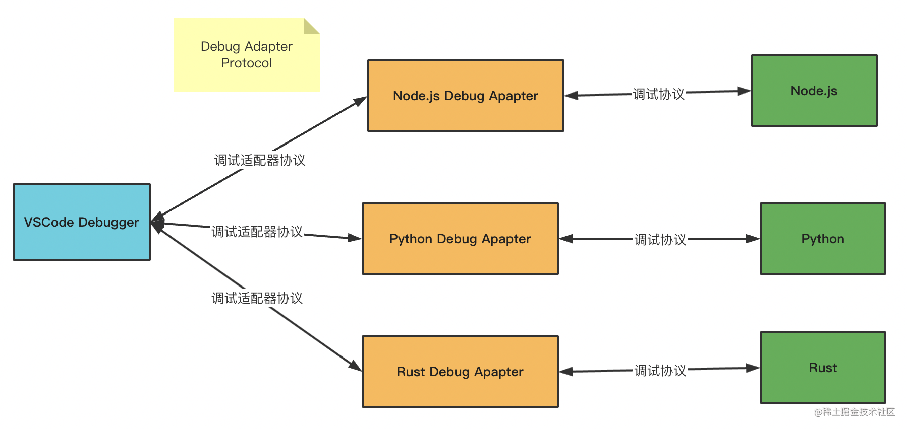
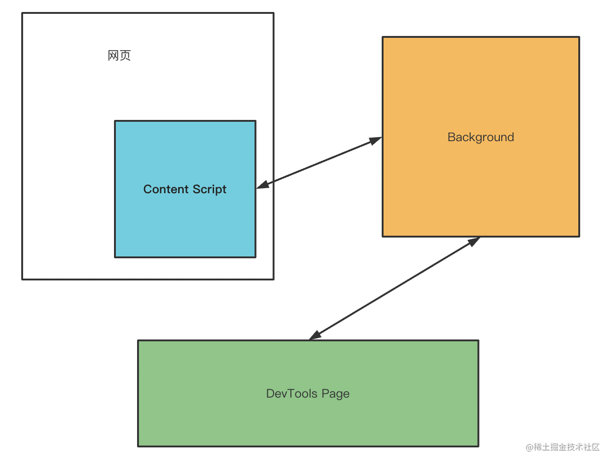
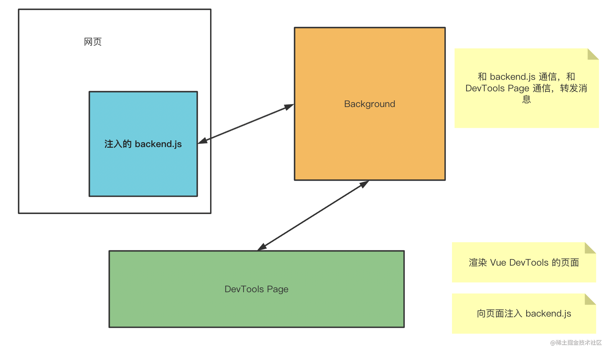

作为前端开发，调试是每天都会接触的概念。你觉得什么是调试呢？

- 有同学说，我用 Chrome DevTools 调试网页，可以查看元素，网络请求，断点运行 JS，用 Performance 工具分析性能等，这是网页的调试。

- 有同学说，我用 VSCode Debugger 调试 Node.js，可以同时调试多个进程的代码。这是 Node.js 的调试。

- 有同学说，我用 React DevTools 和 Vue DevTools 的 chrome 插件来调试 React、Vue 组件，还会用独立的 React DevTools 调试 React Native 应用。这是我常用的调试工具。

没错，这些都属于调试。那它们有什么共同特点呢？

它们都是把运行的状态暴露给调试工具，做一些展示和交互。

所以，我们可以给调试下个定义：

**代码在某个平台运行，把运行时的状态通过某种方式暴露出来，传递给开发工具做 UI 的展示和交互，辅助开发者排查问题、梳理流程、了解代码运行状态等，这个就是调试。**

这里的某个平台，可以是浏览器、Node.js、Electron、小程序等任何能执行 JS 代码的平台。

暴露出的运行时状态，可能是调用栈、执行上下文，或者 DOM 的结构，React 组件的状态等。

暴露出这些数据的方式一般是通过基于 WebSocket 的调试协议，当然也会有别的方式。

那常见的调试工具都是怎么实现的，有没有什么通用的原理呢？

我们分别来看一下：

## Chrome DevTools 原理

Chrome DevTools 分为两部分，backend 和 frontend：

- backend 和 Chrome 集成，负责把 Chrome 的网页运行时状态通过调试协议暴露出来。

- frontend 是独立的，负责对接调试协议，做 UI 的展示和交互。

两者之间的调试协议叫做 Chrome DevTools Protocol，简称 CDP。

传输协议数据的方式叫做信道（message channel），有很多种，比如 Chrome DevTools 嵌入在 Chrome 里时，两者通过全局的函数通信；当 Chrome DevTools 远程调试某个目标的代码时，两者通过 WebSocket 通信。

frontend、backend、调试协议（CDP）、信道，这是 Chrome DevTools 的 4 个组成部分。

backend 可以是 Chromium，也可以是 Node.js 或者 V8，这些 JS 的运行时都支持 Chrome DevTools Protocol。

这就是 Chrome DevTools 的调试原理。

除了 Chrome DevTools 之外，VSCode Debugger 也是常用的调试工具：

## VSCode Debugger 原理

VSCode Debugger 的原理和 Chrome DevTools 差不多，也是分为 frontend、backend、调试协议这几部分，只不过它多了一层适配器协议。

为了能直接用 Chrome DevTools 调试 Node.js 代码，Node.js 6 以上就使用 Chrome DevTools Protocol 作为调试协议了，所以 VSCode Debugger 要调试 Node.js 也是通过这个协议。

但是中间多了一层适配器协议 Debug Adapter Protocol，这是为什么呢？

因为 VSCode 不是 JS 专用编辑器呀，它可能用来调试 Python 代码、Rust 代码等等，自然不能和某一种语言的调试协议深度耦合，所以多了一个适配器层。

这样 VSCode Debugger 就可以用同一套 UI 和逻辑来调试各种语言的代码，只要对接不同的 Debug Adapter 做协议转换即可。

这样还有另一个好处，就是别的编辑器也可以用这个 Debug Adapter Protocol 来实现调试，这样就可以直接复用 VSCode 的各种语言的 Debug Adapter 了。

VSCode Debugger 的 UI 的部分算是 frontend，而调试的目标语言算是 backend 部分，中间也是通过 WebSocket 传递调试协议。

整体和 Chrome DevTools 的调试原理差不多，只不过为了支持 frontend 的跨语言复用，多了一层适配器层。

除了 Chrome DevTools 和 VSCode Debugger 外，平时我们开发 Vue 或 React 应用，还会用 Vue DevTools 和 React DevTools：

## Vue/React DevTools

Vue DevTools 或者 React DevTools 都是以 Chrome 插件（Chrome Extension）的形式存在的，要搞懂它们的原理就得了解 Chrome 插件的机制。

Chrome 插件中可以访问网页的 DOM 的部分叫做 Content Script，随页面启动而生效，可以写一些操作 DOM 的逻辑。还有一部分是后台运行的，叫做 Background，浏览器启动就生效了，生命周期比较长，可以做一些常驻的逻辑。

如果是扩展 DevTools 的 Chrome 插件，那还有一部分 DevTools Page，是在 DevTools 里显示的页面：

Content Script 部分可以操作 DOM，可以监听 DOM Event。

Backgroud 部分可以访问 extension api，可以和 Content Script 还有 DevTools Page 通信。

DevTools Page 部分可以访问 devtools api，可以向当前 window 注入 JS 执行。

这就是 Chrome 插件的大概架构。

Vue DevTools 和 React DevTools 就是基于这个架构来实现的调试功能。

你看[ Vue DevTools 的源码目录](https://github.com/vuejs/devtools/tree/main/packages)会发现，它也是分为 backend 和 frontend 的

那 backend 运行在哪，frontend 运行在哪，两者怎么通信呢？

DevTools Page 是可以在页面 eval JS 的，那就可以注入 backend 的代码。

backend 的代码可以拿到 Vue 组件的信息，通过 window message 的方式传递给 Background。

Background 可以和 DevTools Page 通信，从而实现消息转发。

DevTools Page 根据拿到的数据，渲染组件的信息，实现交互功能。

DevTools Page 部分渲染出的界面是这样的：

React DevTools 也是类似的，都是通过 backend 拿到组件信息，然后传递给 DevTools Page 做渲染和交互。

不过 React DevTools 还有独立的 Electron 应用，可以用于 React Native 的调试。

这种自定义调试工具也是用的 Chrome DevTools Protocol 协议么？

明显不是，CDP 协议用来调试 DOM、JS 等挺不错的，但是不好扩展，如果有别的需求，一般都是自定义调试协议。

过了一遍 Chrome DevTools、VSCode Debugger、Vue/React DevTools 的原理，有没有发现它们有一些相同的地方？

没错，都有 backend 部分负责拿到运行时的信息，有 frontend 部分负责渲染和交互，也有调试协议用来规定不同数据的格式，还有不同的信道，比如 WebSocket 、Chrome 插件的 background 转发等。

**frontend、backend、调试协议、信道，这是调试工具的四要素。**

不过，不同的调试工具都会有不同的设计，比如 VSCode Debugger 为了跨语言复用，多了一层 Debugger Adapter，React DevTools 有独立的 electron 应用，用自定义调试协议，可以调试 React Native 代码。

## 总结

我们会用 Chrome DevTools、VSCode Debugger、Vue/React DevTools 等工具来调试网页、Node.js、React/Vue 的代码，它们都属于调试工具。

调试就是通过某种信道（比如 WebSocket）把运行时信息传递给开发工具，做 UI 的展示和交互，辅助开发者排查问题、了解代码运行状态等。

我们简单过了一遍这些调试工具的原理：

它们有通用的部分，都有 frontend、backend、调试协议、信道这四要素。

也有不同的部分，比如 VSCode Debugger 多了一层 Debugger Adapter，用于跨语言的复用，Vue/React DevTools 通过向页面注入 backend 代码，然后通过 Background 实现双向通信等。

抓住它们相同的部分来分析，理解不同的部分的设计原因，就很容易搞懂各种调试工具的原理了。
